# AWS CI/CD Pipeline — Deployment Guide

This guide documents every step taken to build and deploy the CI/CD pipeline from scratch.

---

## Phase 1 — EC2 Instance Setup

### 1.1 Launch EC2 Instance
- Go to AWS Console → EC2 → Launch Instance
- Name: `cicd-server`
- AMI: Amazon Linux 2023 (Free tier eligible)
- Instance type: `t3.micro` (Free tier)
- Key pair: Create new → `cicd-key` → Download `.pem` file
- Security group: Allow SSH (22), HTTP (80), Custom TCP (5000)

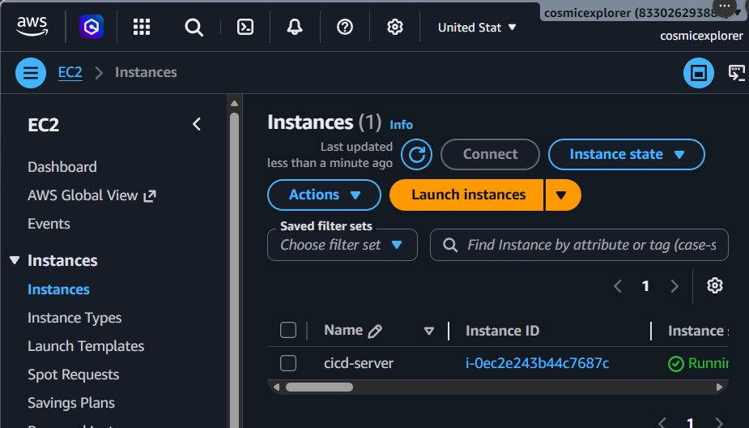

---

### 1.2 Configure Security Group (Inbound Rules)

Open these ports in the EC2 security group:

| Type | Protocol | Port | Source |
|------|----------|------|--------|
| SSH | TCP | 22 | 0.0.0.0/0 |
| HTTP | TCP | 80 | 0.0.0.0/0 |
| Custom TCP | TCP | 5000 | 0.0.0.0/0 |

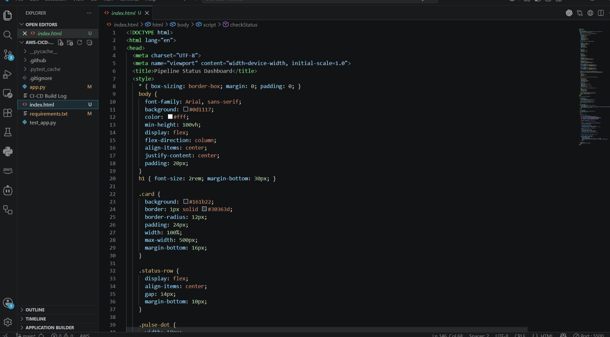

---

### 1.3 SSH into EC2

Fix `.pem` file permissions on Windows:
```bash
icacls "C:\Users\YourName\Downloads\cicd-key.pem" /inheritance:r /grant:r "YourName:R"
```

Connect:
```bash
ssh -i "C:\Users\YourName\Downloads\cicd-key.pem" ec2-user@YOUR_EC2_IP
```

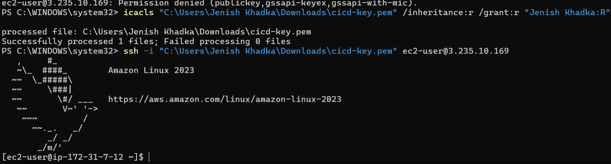

---

### 1.4 Install Dependencies on EC2

```bash
sudo yum update -y
sudo yum install python3 python3-pip git -y
pip3 install flask gunicorn flask-cors
mkdir ~/app
```

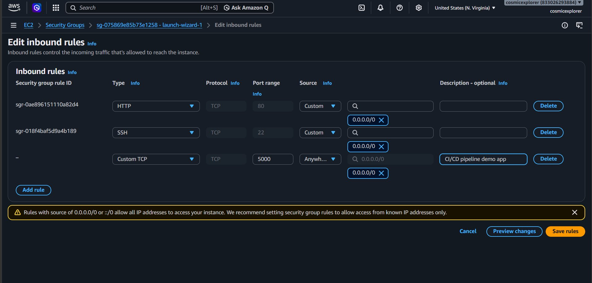

**Verified versions:**
- Python 3.9.25
- Gunicorn 23.0.0

---

### 1.5 Set Up Systemd Service

Create a systemd service so the app runs as a proper background service:

```bash
sudo nano /etc/systemd/system/myapp.service
```

Paste:
```ini
[Unit]
Description=Flask App
After=network.target

[Service]
User=ec2-user
WorkingDirectory=/home/ec2-user/app
ExecStart=/home/ec2-user/.local/bin/gunicorn -w 2 -b 0.0.0.0:5000 app:app
Restart=always

[Install]
WantedBy=multi-user.target
```

Enable and start:
```bash
sudo systemctl daemon-reload
sudo systemctl enable myapp
sudo systemctl start myapp
sudo systemctl status myapp
```

---

## Phase 2 — GitHub Actions CI/CD Pipeline

### 2.1 Add GitHub Secrets

Go to GitHub repo → Settings → Secrets and variables → Actions → New repository secret

| Secret Name | Value |
|---|---|
| `EC2_HOST` | Your EC2 public IP |
| `EC2_SSH_KEY` | Contents of `cicd-key.pem` |

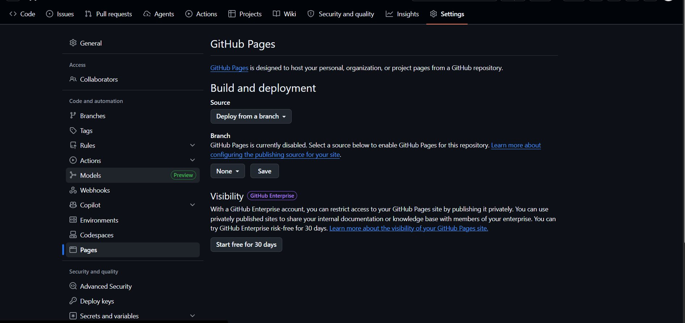

---

### 2.2 Create Workflow File

Create `.github/workflows/deploy.yml`:

```yaml
name: CI/CD Pipeline

on:
  push:
    branches: [main]

jobs:
  test:
    runs-on: ubuntu-latest
    steps:
      - uses: actions/checkout@v4
      - name: Set up Python
        uses: actions/setup-python@v5
        with:
          python-version: "3.10"
      - name: Install dependencies
        run: pip install -r requirements.txt
      - name: Run tests
        run: pytest test_app.py -v

  deploy:
    needs: test
    runs-on: ubuntu-latest
    steps:
      - uses: actions/checkout@v4
      - name: Deploy to EC2
        env:
          EC2_HOST: ${{ secrets.EC2_HOST }}
          EC2_KEY: ${{ secrets.EC2_SSH_KEY }}
        run: |
          echo "$EC2_KEY" > key.pem
          chmod 600 key.pem
          scp -i key.pem -o StrictHostKeyChecking=no \
            app.py requirements.txt ec2-user@$EC2_HOST:~/app/
          ssh -i key.pem -o StrictHostKeyChecking=no ec2-user@$EC2_HOST \
            "pip3 install -r ~/app/requirements.txt && \
             sudo systemctl restart myapp"
      - name: Update status
        env:
          EC2_HOST: ${{ secrets.EC2_HOST }}
        run: |
          sleep 5
          STATUS=$(curl -s --max-time 5 http://$EC2_HOST:5000/health || echo '{"status":"down"}')
          TIMESTAMP=$(date -u +"%Y-%m-%dT%H:%M:%SZ")
          echo "{\"status\":\"$(echo $STATUS | grep -o 'healthy' || echo 'down')\",\"timestamp\":\"$TIMESTAMP\"}" > status.json
          git config user.email "actions@github.com"
          git config user.name "GitHub Actions"
          git add status.json
          git diff --staged --quiet || git commit -m "Update status [skip ci]"
          git push
```

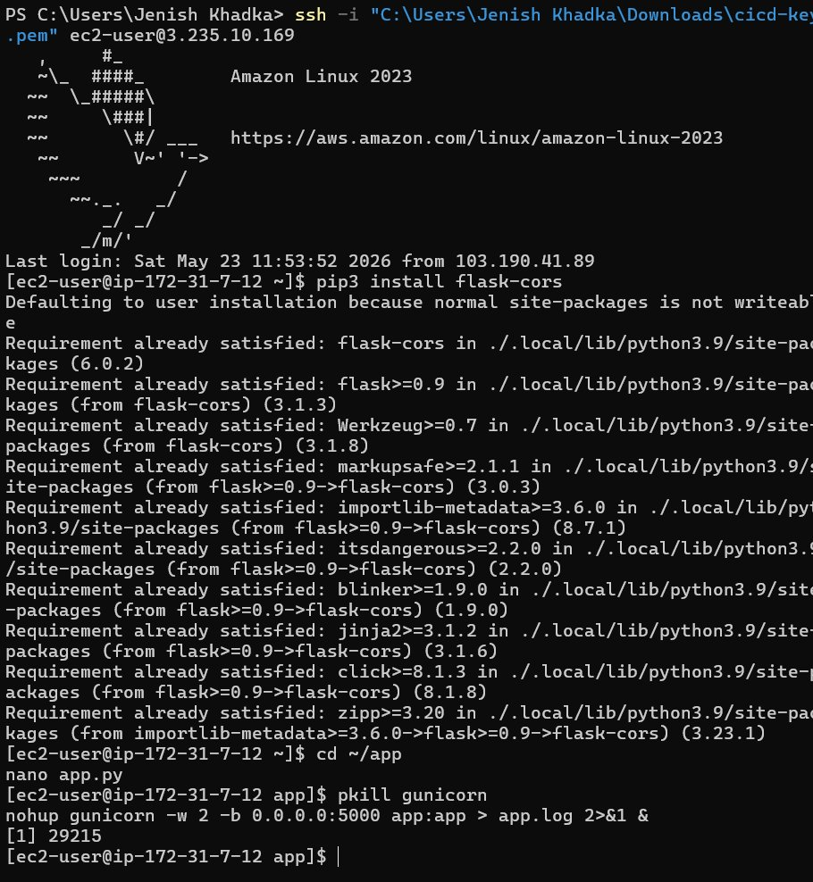

---

## Phase 3 — App Verification

### 3.1 Test Endpoints

After deploy, verify the app is live:

- `http://YOUR_EC2_IP:5000` → returns `{"status":"ok","message":"Hello from CI/CD pipeline!"}`
- `http://YOUR_EC2_IP:5000/health` → returns `{"status":"healthy"}`

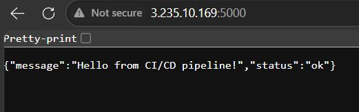
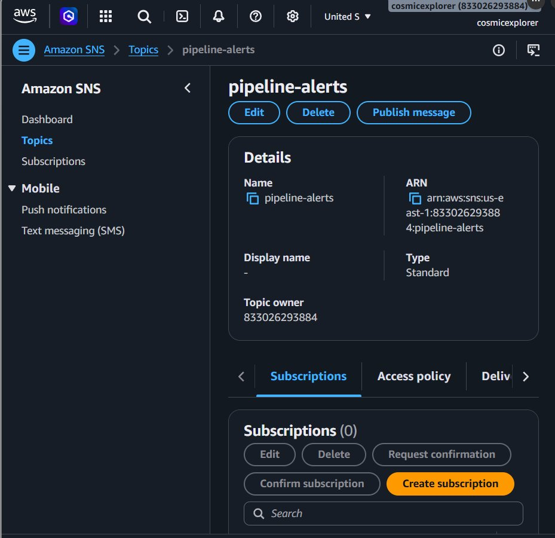

---

## Phase 4 — CloudWatch Monitoring

### 4.1 Create SNS Topic

1. AWS Console → SNS → Topics → Create topic
2. Type: Standard
3. Name: `pipeline-alerts`
4. Create subscription → Protocol: Email → your email
5. Confirm subscription from email

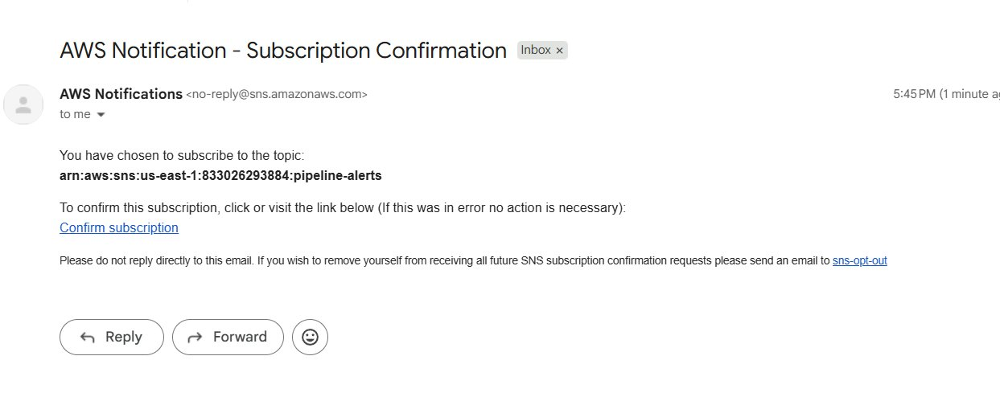

---

### 4.2 Create CloudWatch Alarm

1. AWS Console → CloudWatch → Alarms → Create alarm
2. Select metric → EC2 → Per-Instance Metrics → CPUUtilization
3. Threshold: Greater than 80%
4. Action: Send to `pipeline-alerts` SNS topic
5. Name: `high-cpu-alert`

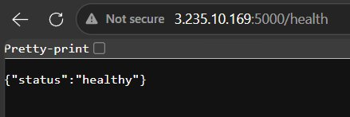
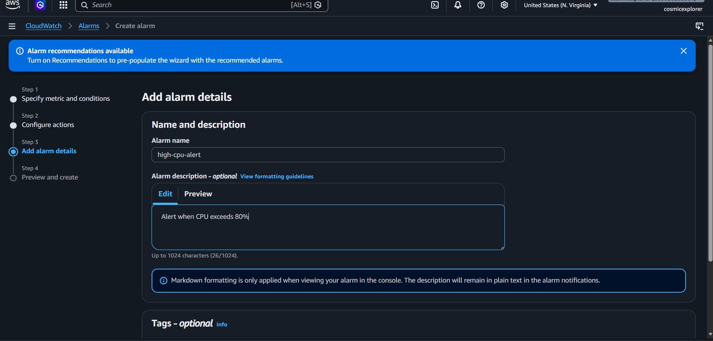
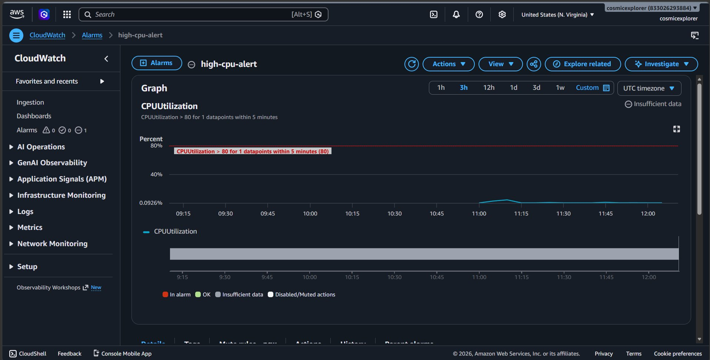

---

## Phase 5 — Live Status Dashboard

Hosted on GitHub Pages at:
```
https://YOUR_GITHUB_USERNAME.github.io/aws-cicd-monitor
```

Features:
- 🟢 Animated pulse dot showing server status
- ⚡ Response time display
- ✅ GitHub Actions pipeline badge
- 📋 Check history (last 5 checks)

Enable GitHub Pages: repo Settings → Pages → Branch: main → / (root) → Save

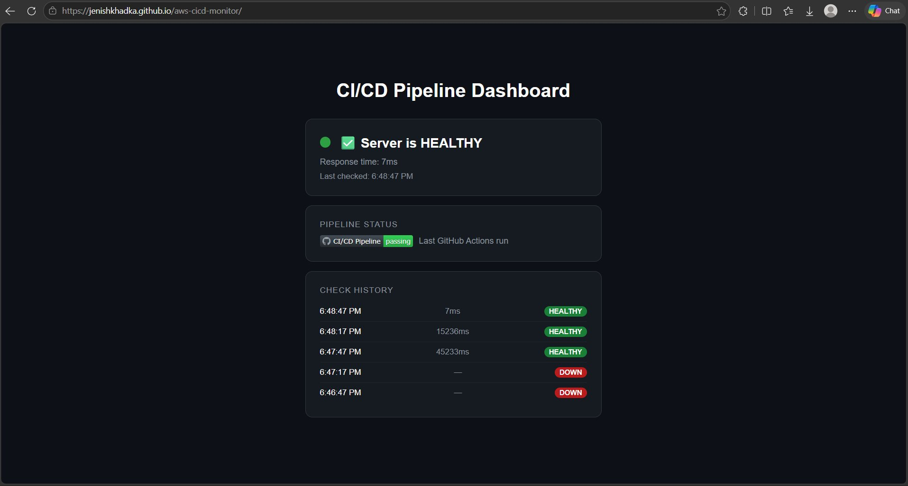

---

## Screenshots Naming Guide

| Filename | Description |
|---|---|
| `ssh-connected.png` | First successful SSH login to EC2 |
| `ec2-running.png` | EC2 console showing instance running |
| `security-group.png` | Inbound rules with port 5000 open |
| `packages-installed.png` | Python + Gunicorn versions verified |
| `github-secrets.png` | EC2_HOST and EC2_SSH_KEY added |
| `pipeline-passing.png` | GitHub Actions all green |
| `app-live.png` | Flask app responding in browser |
| `health-endpoint.png` | /health endpoint returning healthy |
| `sns-email.png` | AWS subscription confirmation email |
| `cloudwatch-metric.png` | Selecting CPUUtilization metric |
| `cloudwatch-actions.png` | SNS topic configured for alarm |
| `cloudwatch-alarm.png` | high-cpu-alert dashboard |
| `dashboard-live.png` | Live status dashboard on GitHub Pages |
