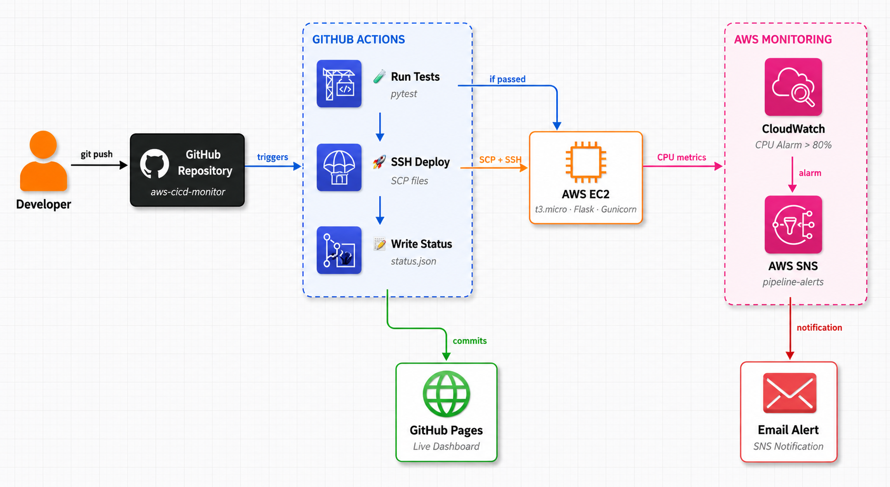

#  AWS CI/CD Pipeline with Live Monitoring Dashboard


A production-style DevOps project demonstrating the full software delivery lifecycle — every `git push` automatically tests, deploys, and monitors a live Flask application on AWS. Built entirely from scratch on a Windows machine using SSH to configure a remote Linux server.

**[🟢 Live Dashboard](https://jenishkhadka.github.io/aws-cicd-monitor)**

---

## 🏗️ Architecture
MedLens AI (final year project)

What it is: A fully offline medical assistant that runs on a local LLM (BioMistral-7B via Ollama) with no cloud dependency
Problem it solves: Works with low internet and low-spec hardware, which matters in places like Nepal
6 modules: medical chat, medicine scanner, symptom checker, drug interaction checker, health report analyzer, medicine reminders
RAG pipeline (two stages): SQLite keyword match, then FAISS vector search, to reduce hallucination
Embedding model: all-MiniLM-L6-v2
Medicine scanner: YOLOv8 + EasyOCR + OpenCV identify medicines from photos
Data: 11,825 medicines and 31,169 vector embeddings indexed for offline lookup
Tools: Python, Flask, LangChain, SQLite, FAISS, HTML/CSS/JavaScript
Evaluation: ROUGE, BLEU, response time, OCR accuracy


A developer pushes code to GitHub, which triggers GitHub Actions to run tests and deploy to AWS EC2 via SSH. The Flask app runs on EC2 under Gunicorn and systemd. CloudWatch monitors CPU usage and fires an SNS email alert if it exceeds 80%. After each deployment, the pipeline writes the server status to `status.json`, which the GitHub Pages dashboard reads to display live health and check history.

---

## ⚙️ Tech Stack

| Layer | Tool |
|---|---|
| App | Python Flask |
| CI/CD | GitHub Actions |
| Cloud | AWS EC2 (t3.micro) |
| Monitoring | AWS CloudWatch |
| Alerts | AWS SNS |
| Dashboard | GitHub Pages |

---

## 🔄 Pipeline Flow

1. **Push code** to `main` branch
2. **GitHub Actions** spins up a fresh Ubuntu runner
3. **Tests run** via pytest — pipeline stops if they fail
4. **Code deploys** to AWS EC2 via SSH
5. **Systemd restarts** the Flask app automatically
6. **Status checked** and written to `status.json`
7. **Dashboard updates** at [jenishkhadka.github.io/aws-cicd-monitor](https://jenishkhadka.github.io/aws-cicd-monitor)

---

## 📊 Monitoring

- **CloudWatch** watches CPU utilization 24/7
- **SNS** sends an email alert if CPU exceeds 80%
- **Live dashboard** shows server health, response time, and check history

---

## 🚀 How to Run Locally

```bash
git clone https://github.com/jenishkhadka/aws-cicd-monitor
cd aws-cicd-monitor
pip install -r requirements.txt
python app.py
```

Visit `http://localhost:5000`

---

## 🧪 Run Tests

```bash
python -m pytest test_app.py -v
```

---

## 📁 Project Structure

```
aws-cicd-monitor/
├── .github/
│   └── workflows/
│       └── deploy.yml        # CI/CD pipeline
├── screenshots/
│   ├── architecture.png      # Architecture diagram
│   └── ...                   # Deployment screenshots
├── app.py                    # Flask application
├── test_app.py               # Pytest tests
├── requirements.txt          # Dependencies
├── index.html                # Live status dashboard
├── status.json               # Auto-updated server status
└── AWS-DEPLOYMENT-GUIDE.md   # Step-by-step deployment guide
```

---

## 📖 Deployment Guide

For a full step-by-step walkthrough of how this was built — including AWS setup, EC2 configuration, GitHub Actions, CloudWatch, and SNS — see the **[AWS Deployment Guide](AWS-DEPLOYMENT-GUIDE.md)**.

> **Note:** The EC2 instance may be stopped to stay within AWS free tier limits. The dashboard and deployment guide remain fully accessible.
